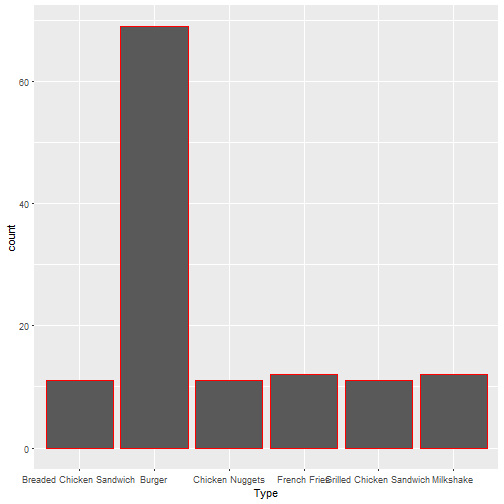

#Fast Food Restaurants Popular Menu Nutritional Facts Pitch

author: Abdullah Albyati date: 17-Sep-2017 autosize: true

The Data

The data set was collected in January of 2017 by looking through online nutritional information provided by fast food restaurant chains. Nutrition data on various burgers, a breaded chicken sandwich, a grilled chicken sandwich, chicken nuggets, french fries, and a chocolate milkshake were collected for each restaurant (when applicable). For each chain the smallest hamburger, the smallest cheeseburger, and a variety of their most well known larger burgers were selected.

The link to the data set is https://www.statcrunch.com/app/index.php?dataid=2323899.

Summary of the Data set

dataset <- read.csv("dataset.csv")
summary(dataset)
      Fast.Food.Restaurant                       Item    
 Carl's Jr.     :13        Grilled Chicken Sandwich:  3  
 Jack in the Box:13        Hamburger               :  3  
 Hardee's       :12        Cheeseburger            :  2  
 Wendy's        :12        Kids Cheeseburger       :  2  
 Whataburger    :12        Kids Hamburger          :  2  
 Burger King    :11        Small French Fries      :  2  
 (Other)        :53        (Other)                 :112  
                       Type    Serving.Size..g.    Calories     
 Breaded Chicken Sandwich:11   Min.   : 44.0    Min.   : 130.0  
 Burger                  :69   1st Qu.:126.5    1st Qu.: 330.0  
 Chicken Nuggets         :11   Median :217.5    Median : 515.0  
 French Fries            :12   Mean   :224.3    Mean   : 532.5  
 Grilled Chicken Sandwich:11   3rd Qu.:315.2    3rd Qu.: 670.0  
 Milkshake               :12   Max.   :467.0    Max.   :1240.0  
                                                                
 Total.Fat..g.   Saturated.Fat..g. Trans.Fat..g.     Sodium..mg.    
 Min.   : 3.50   Min.   : 1.00     Min.   :0.0000   Min.   :  50.0  
 1st Qu.:14.18   1st Qu.: 3.50     1st Qu.:0.0000   1st Qu.: 569.2  
 Median :22.50   Median : 7.75     Median :0.5000   Median : 930.0  
 Mean   :28.54   Mean   :10.15     Mean   :0.8211   Mean   : 973.7  
 3rd Qu.:39.50   3rd Qu.:15.00     3rd Qu.:1.5000   3rd Qu.:1285.2  
 Max.   :87.00   Max.   :35.00     Max.   :4.0000   Max.   :2460.0  
                                   NA's   :12                       
   Carbs..g.        Sugars..g.     Protein..g.   
 Min.   :  6.00   Min.   : 0.00   Min.   : 2.00  
 1st Qu.: 33.00   1st Qu.: 3.00   1st Qu.:13.00  
 Median : 42.50   Median : 7.00   Median :23.00  
 Mean   : 44.57   Mean   :13.28   Mean   :24.85  
 3rd Qu.: 54.00   3rd Qu.:11.00   3rd Qu.:34.00  
 Max.   :106.00   Max.   :93.00   Max.   :69.00  
                                                 
Visualize the Data

App features

The shiny app will help you navigate the data set easy by:

Filtering by restaurant
Filtering by Menu Item
Shiny App Link

To use the app please vist

https://albyati.shinyapps.io/FastFood/
